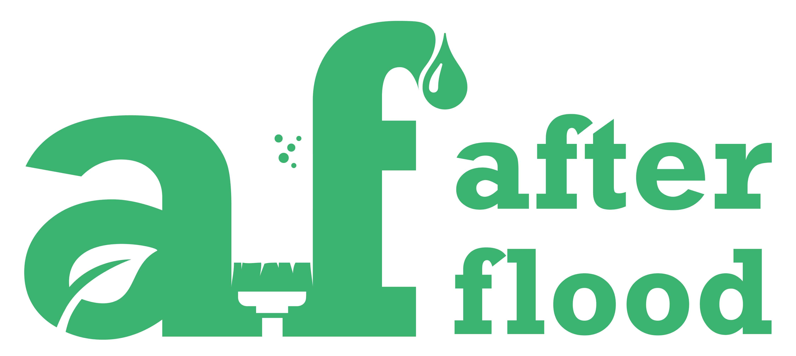

# \#AfterFlood

> A crowd sourced data hub for information regarding all the Do's and don'ts, waste management, personal hygiene and every other aspect which needs to be kept in mind while moving back home after the flood


\*\*\*\*[**infographics.afterflood.in**](https://infographics.afterflood.in/#/)  
Concise, reliable and shareable infographics for health, environmental and social awareness during the time of rehabilitation after a natural disaster.



**Download a copy of Comprehensive Clean-Up Guide PDF**  
[**doc.afterflood.in**](http://doc.afterflood.in/)



**Facebook ChatBot:** [**chat.afterflood.in**](http://chat.afterflood.in/)





**Please do not use Sodium polyacrylate for cleaning flood water**  
[**Read More: https://www.afterflood.in/cleaning/**](https://www.afterflood.in/easy-hack-for-cleaning)\*\*\*\*


## Health Management

















## Waste Management







## Comprehensive Clean-Up Guide

























## Safety  Management





















## Insurance



## Videos



















## General Note


## Ensure building safety


* Make sure the building is structurally safe.
* Look for buckled walls or floors.
* Watch for holes in the floor, broken glass and other potentially dangerous debris.


## **Travel with care.**


* Follow recommended routes. DO NOT sightsee.
* Watch for washed out roads, earth slides, and downed trees or power lines.
* Stay away from downed power lines.


## Contribute to www.afterflood.in


1. Fork the GitHub repo [https://github.com/afterflood/afterflood.in](https://github.com/afterflood/afterflood.in)
2. Create a new file with `.md` extension.
3. Update the path to file in `README.md` \(The front page\) & `SUMMARY.md` \(for ordering in sidebar\)
4. Use Markdown language for updating the script.
5. Make a PR for merge.

Or email us at `afterflood.in@gmail.com`



